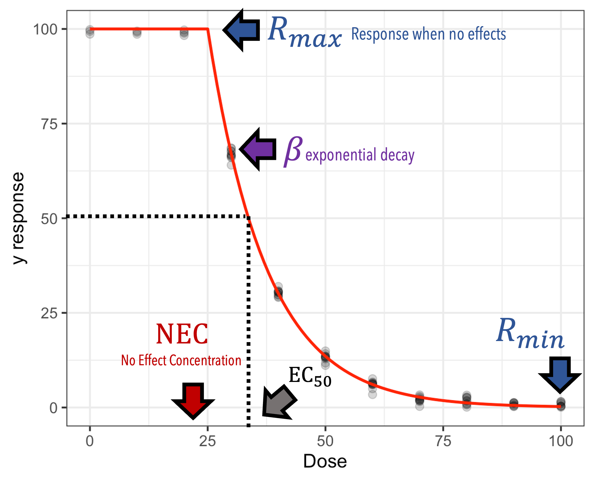
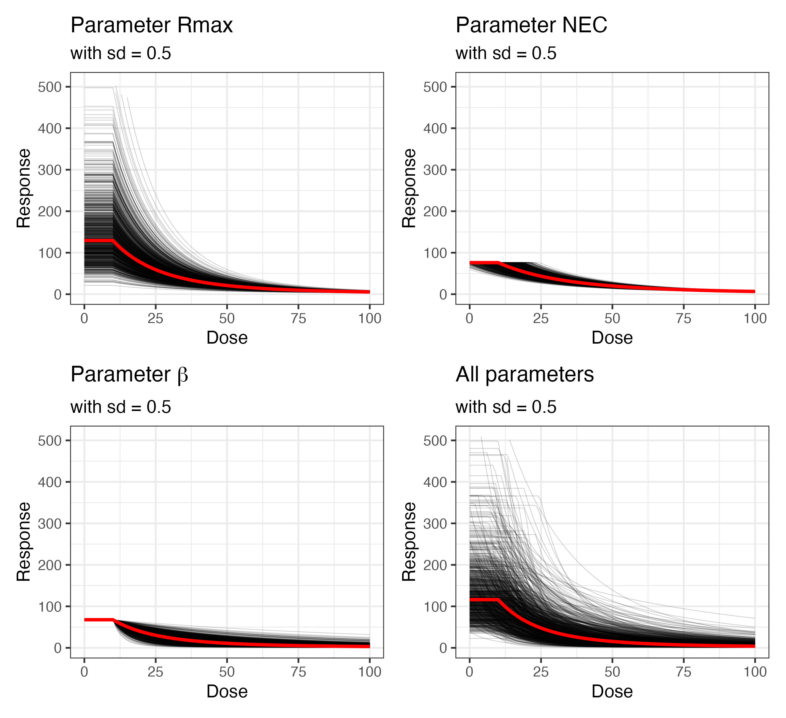

```{r setup, include=FALSE}
knitr::opts_chunk$set(fig.align = "center", fig.retina = 3,
                      fig.width = 6, fig.height = (6 * 0.618),
                      out.width = "90%", collapse = TRUE)
options(digits = 3, width = 300)
```

```{r}
library(here)
library(tidyverse)
library(tinytable)
# print(getwd())
```

# Problem description and model specification
Phenotypic variation is common in biology, yet is poorly accounted for in ecotoxicology and environmental risk assessment. When variation is ignored, this may lead to decision that do not protect the most sensitive individuals in a population. The following study attempts to answer the following fundamental questions:

1. What is the risk of ignoring biological variation when estimating ecotoxicological parameters?
1. What are optimal designs and sample sizes for estimating among-individual or among-genotype variation?

To answer (1), we run a simulation study where we compare the estimation of ecotoxicological parameters while varying the magnitude of among-genotype differences. To answer (2), we simulate data with increased sample sizes and / or different experimental designs to determine which design yields the best estimation of among-individual differences in ecotoxicological parameters

# A hierarchical dose-response model for capturing heterogeneous responses to contaminant exposure

We chose a common dose-response model where a biological response $R$ remains unchanged while the contaminant dose remains below a No Effect Concentration ($NEC$). As soon as the dose falls above the NEC, the response declines at an exponential rate $-e^{\beta}$ until it reaches a lower bound $R_{min}$. 

$$
R = \begin{cases}
R_{min} & \text{when } (Dose \le NEC) \\
R_{min} + (R_{max} - R_{min}) e^{-e^{\beta \times (Dose - NEC)}} & \text{when } (Dose > NEC)
\end{cases}
$$
{width=80%}


We assume the response is positive with an average value $R_{max} = 100$ and a lower bound $R_{min} = 1$. We then assume that we are able to observe the response of distinct genotypes, each varying in their sensitivity to the contaminant. This means that each genotype can have a unique value for the parameters $R_{max}$, $NEC$ and $\beta$. For simplicity, we assume that the lower bound $R_{min}$ is shared among all genotypes.

The model can therefore be rewritten as a hierarchical model such that the average value of each genotype differs from the population average by a normally-distributed offset that depends on the amount of among-genotype variation. We use a lognormal likelihood to contrain the estimations to be stricly positive and use a Bayesian framework with weak priors to constrain the data around plausible values. The full model can thus be written as: 

$$
\begin{aligned}
\large \text{Model Likelihood}\\
\text{Average dose-response}\\
R_{i} &\sim Lognormal(log(\mu_{i}), \sigma) \\
log(\mu_{i}) &= log(R_{min_i}) + (log(R_{max_i}) - log(R_{min_i})) e^{-e^{\beta_i \times (Dose - NEC_i) \times (Dose > NEC_i)}} \\
\text{Among-genotype variances}\\
R_{min_i} &\sim N(\mu_{R_{min}}, \sigma_{R_{min}}) \\
R_{max_i} &\sim N(\mu_{R_{max}}, \sigma_{R_{max}}) \\
NEC_i &\sim N(\mu_{NEC}, \sigma_{NEC}) \\
\large \text{Priors}\\
\small \text{Values needed for reasonable priors}\\
min_R &= quantile_{10}(R) \\
max_R &= quantile_{90}(R) \\
sd_{min_R} &= min_R \times 0.5 \\
sd_{max_R} &= min_R \times 0.5 \\
med_{NEC} &= median(Dose) \\
sd_{NEC} &= med_{NEC} \times 0.5 \\
\text{Population Intercepts}\\
\mu_{R_{min}} &\sim N(log(min_R), sd_{min_R})) \\
\mu_{R_{max}} &\sim N(log(max_R), sd_{max_R}) \\
\mu_{NEC} &\sim N(med_{NEC}, sd_{NEC}) \\
\text{Among-individual variances}\\
\sigma_{R_{min}} &\sim Exp(1) \\
\sigma_{R_{min}} &\sim Exp(1) \\
\sigma_{R_{min}} &\sim Exp(1) \\
\text{Residual variance}\\
\sigma &\sim Exp(10) \\
\end{aligned}
$$

Here is what the patterns would look like assuming an among-genotype sd of 0.5:

{width=80%}

## Setting up the simulation study

This is still work in progress. Ideally, I'd like to use the functions from the package [{SBC}](https://hyunjimoon.github.io/SBC/index.html) to generate the datasets for each simulation and build a pipeline for automating the analysis and its report through 
[{targets}](https://books.ropensci.org/targets/) and [{stantargets}](https://docs.ropensci.org/stantargets/). This is a fairly complex process and it may be quicker to make everything from scratch yet. In the meantime the script used to generate the figure above can be found under `R\funs\test_funs.R`, which calls `R\funs\script_funs.R`. The latter is where I will store all functions to generate the simulated datasets, run the Bayesian models on each dataset and store the results of the analysis. Many of the functions are still under construction and need more validation. 

::: {.callout-warning}
When working with {targets}, note that quarto rendering must also be done through the `tar_quarto()` function. In addition, this will only render the document if the pipeline is fully functional. It may be better to fork this project to test the  pipeline with targets independently!
:::

# When is individual variation problematic for the estimation of ecotoxicological parameters?
With this general model, we will investigate three cases for which the presence of among-genotype variance can potentially bias our estimation of the population averages for the ecotoxicological parameters $\mu_{NEC}$ and $\mu_{\beta}$:

- Case 1: Only the average response $R_{max}$ differs among genotypes
- Case 2: Only the $NEC$ differs among genotypes
- Case 3: Only the decay rate $\beta$ differs among genotypes
- Case 4: All three parameters vary independently among genotypes
- Case 5: All three parameters covary among genotypes

In each case, we generate 1000 datasets by simulating from the model version including the among-genotype variation for the specific set of parameters under consideration. We compare the fit of a model ignoring individual difference with a correctly-specified model. We rely on the following metrics to assess our models performances:

- % Bias: a metric indicating how far off our estimate is from the true parameter value and defined as the percent distance to the true value of the parameter $\frac{(\theta - \hat{\theta})}{\hat{\theta}} \times 100$ 
- Precision: a metric indicating the agreement in parameter values for a given set of simulations and defined as the difference between the 25th and 75th quantiles for a given set of simulations $q_{sim_{25}} - q_{sim_{75}}$ 
- RMSE: an additional metric for the distance between the true value and the model estimate, defined as the square root of average difference between the true value of the parameter and the posterior median estimated from the model $\sqrt{E(\theta - \hat{\theta})}$

::: {.callout-note}
Because we are using Bayesian methods, the specific metrics for the evaluation of the model require more consideration. Here I am reproducing what I've used in past project, but these ignore the posterior distribution of parameters. [Kruschke and Liddell 2018](https://doi.org/10.3758/s13423-016-1221-4) seems to be a good starting point for conducting a Bayesian power analysis.
:::

We also want to understand how strong these genotype differences need to be so that the estimation of ecotoxicological parameters is problematic when not explicitly modeled. We will therefore run each case with increasing values for the among-genotype parameters: $\sigma_i = [0, 1, 10, 20, 30, 40, 50]$, where $\sigma_i$ corresponds to the among-genotype coefficient standard deviation. For parameters $R_{max}$ and $\beta$, which are modeled on the log-scale, setting $\sigma_i = 0.5$ corresponds roughly to a coefficient of variation of 0.5 on the data scale. For  the $NEC$ parameter, $\sigma_i$ is calculated as $\sigma_{i_{NEC}} = CV_{i_{NEC}} \times \mu_{NEC}$. 

The full simulation plan is summarized in the table below:

```{r}
#| tbl-cap: Parameter values for all planned simulations
options(tinytable_html_mathjax = TRUE)
tble = data.frame(Parameter = c("$R_{min}$","$R_{max}$","$NEC$","$\\beta$"),
                  mean = c(1, 100, 10, 0.011),
                  sd = c("$0$", "$[0, 0.01, 0.1, 0.2, 0.3, 0.4, 0.5]$",
                         "$[0, 0.01, 0.1, 0.2, 0.3, 0.4, 0.5] \\times \\mu_{NEC}$",
                         "$[0, 0.01, 0.1, 0.2, 0.3, 0.4, 0.5] \\times \\mu_{\beta}$"),
                  Simulations = c(1000, 1000, 1000, 1000))
tt(tble) %>% 
  style_tt(align = "c") %>% 
  style_tt(i = 0, 
           color = "white", 
           background = "black",
           align = "c") %>% 
  format_tt(j = "mean", digits = 1)

```


# Limits of the dose-response reaction norm approach

In many cases, we do not have access to genotypes or clonal lines we can neatly expose through the totality of the dose gradient. What is much more common is to expose sample groups of individuals and randomly assign them to a dose treatment. In this section we consider three additional scenarios that more closely match with the way ecotoxicological data is gathered:

1. Individual responses are measured only once and for a unique dose along the gradient
1. Individual responses are measured multiple times during the course of exposure to a single dose
1. Individual responses are measured repeatedly before and after exposure

For each scenario we ask the following questions: (*i*) 
What are optimal sampling designs for a robust estimation of ecotoxicological parameters ($\mu_{NEC}$ and $\mu_{beta}$) and (*ii*) How should individual differences in  be accounted for?    


## Sampling designs for dealing with individual differences in ecotoxicology in absence of repeated measurements

A very simple way to account for heterogeneity in dose-response models is to define a lower quantile for the population sensitivity we wish to protect. This is akin to benchmark dose (*to be confirmed*). For example, if we wish to define a $NEC$ such that at least 75% of the population is above the threshold value, we should estimate $NEC_{q_{25}}$, corresponding to the lower 25 quantile for the distrbution of NEC. This is easily computed from the posterior distribution of parameters when using Bayesian methods.  

HERE BE PRETTY FIGURE

However, this value may be sensitive to the sampling design and the number of individuals tested per dose. As a result, we plan to run the following simulations:

TODO!


## Sampling designs to estimate individual differences in ecotoxicology

TODO!

### Sampling designs with repeated measures during exposure

### Sampling designs with repeated measures before and during exposure


